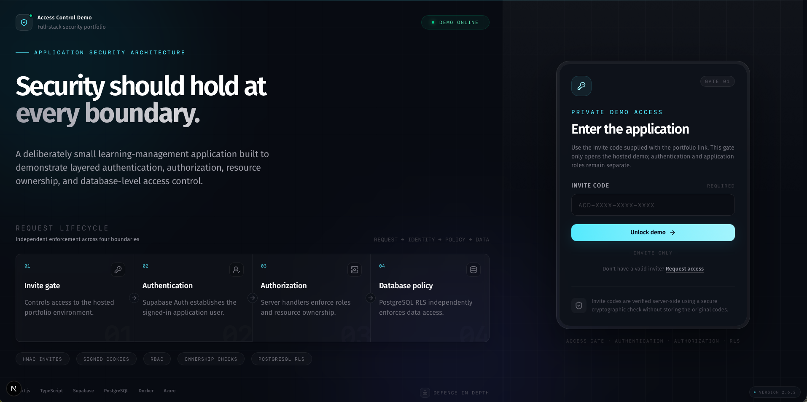
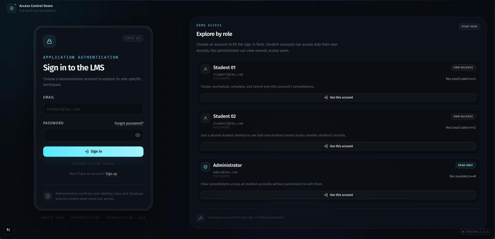

# Access Control Demo

A small full-stack learning management system demonstrating layered access control, authentication, role-based authorization, resource ownership, type-safe API boundaries, client-side server-state management, and PostgreSQL row-level security.

The application is built with Next.js, React, TypeScript, SWR, Valibot, Supabase, PostgreSQL, Docker, and Azure Container Apps.

The LMS domain is intentionally small so the authentication, authorization, data-flow, and security boundaries remain explicit and easy to review.

## What this project demonstrates

- An outer invite-based access gate for hosted portfolio and recruiter demos
- Signed, expiring access-gate cookies
- HMAC-based invite-code storage without retaining plaintext codes
- Server-side rate limiting on invite redemption to reduce automated brute-force attempts
- Email and password authentication with Supabase Auth
- Email confirmation and password recovery
- Protected application routes
- Role-based access control for students and administrators
- Resource ownership checks for student consultations
- Server-side authorization in Next.js route handlers
- PostgreSQL row-level security
- Read-only administrator access
- Generated Supabase database types as the source of truth for database rows and enums
- Typed Supabase clients across proxy and server boundaries
- Server Action-backed authentication mutations with no direct browser Supabase access
- Valibot runtime validation for request input and consultation API responses
- A dedicated consultation API client that isolates HTTP transport from React components
- SWR-based client-side server-state caching and revalidation
- Scoped React hooks that separate consultation queries from mutation orchestration
- Component-local state for row-specific consultation interactions
- Local authentication email testing with MailPit
- Automated unit, proxy, API-client, route-handler, database, and container integration tests
- Containerized deployment with Docker
- GitHub Actions CI/CD
- Azure Container Apps deployment through Bicep and GitHub OIDC

## Access-control model

The hosted application has two separate access boundaries:

```text
Visitor
   |
   v
Invite access gate
   |
   v
Supabase authentication
   |
   v
Application authorization
   |
   v
PostgreSQL row-level security
```

## Access-control model

The hosted application has separate visitor-access, authentication, authorization, and database-security boundaries:

```text
Visitor
   |
   v
Invite access gate
   |
   v
Supabase authentication
   |
   v
Application authorization
   |
   v
PostgreSQL row-level security
```

The invite gate determines who may reach the demonstration environment. It does not identify an LMS user or grant a student or administrator role.

### Environment access gate



After entering the demonstration environment, visitors can select one of the seeded demo accounts from the login screen.

Two student accounts and one administrator account are provided so the different authorization boundaries can be explored without creating users manually.

### Demo login



The authenticated application has two roles:

| Role          | Access                                                                             |
| ------------- | ---------------------------------------------------------------------------------- |
| Student       | View, create, reschedule, complete, and cancel their own consultations             |
| Administrator | View consultations belonging to all students through a read-only dashboard and API |
|               |

uthorization is enforced independently by the Next.js application and PostgreSQL row-level security.

The user interface reflects the permissions available to each role, but the UI itself is not treated as a security boundary.

## Quick start

### Prerequisites

- Node.js LTS
- npm
- Supabase CLI
- Docker

Start the complete local environment with:

```bash
npm run demo:start
```

This:

1. Installs dependencies.
2. Starts local Supabase services.
3. Applies database migrations and seed data.
4. Generates `.env.local`.
5. Starts the Next.js development server.

The application runs at:

```text
http://localhost:3000
```

Create a local invite:

```bash
npm run invite:create -- --label "Local demo" --days 14
```

The command prints the plaintext invite once, for example:

```text
code: ACD-4GZ3-PDQJ-FWT9
path: /?code=ACD-4GZ3-PDQJ-FWT9
```

Open the generated path or enter the invite code at:

```text
http://localhost:3000/
```

For full local setup and environment configuration, see [Development](docs/development.md).

## Demo accounts

The local seed data creates:

| Role          | Email              | Password           |
| ------------- | ------------------ | ------------------ |
| Student       | `student1@lms.com` | `ReviewStudent**1` |
| Student       | `student2@lms.com` | `ReviewStudent**2` |
| Administrator | `admin@lms.com`    | `ReviewAdmin**0`   |

These credentials are intended only for the demonstration environment.

Invite codes are not seeded into the database. Create them after resetting the local database with:

```bash
npm run invite:create -- --label "Local demo" --days 14
```

## Suggested walkthrough

### Visitor access

1. Create a local invite.
2. Open `/`.
3. Enter the generated invite code.
4. Confirm that the application redirects to the LMS login.
5. Delete the `access_gate` browser cookie.
6. Re-enter the same invite.
7. Confirm that access is restored without extending the original database expiry.

### Student

1. Sign in as `student1@lms.com`.
2. Confirm that only Student 1's consultations are displayed.
3. Create a consultation.
4. Mark the consultation as complete.
5. Mark it as incomplete.
6. Reschedule it.
7. Cancel it.
8. Sign out.
9. Sign in as `student2@lms.com`.
10. Confirm that Student 1's consultations are not visible.

### Administrator

1. Sign in as `admin@lms.com`.
2. Open the administrator consultations page.
3. Confirm that consultations belonging to both students are visible.
4. Confirm that the view is read-only.
5. Confirm that no consultation mutation controls are available.

## Documentation

Detailed project documentation is split by responsibility:

- [Access control and API](docs/access-control.md) — invite access, authentication, authorization, RLS, consultation lifecycle, API routes, and database model
- [Architecture](docs/architecture.md) — application boundaries, SWR, runtime validation, generated types, and design decisions
- [Development](docs/development.md) — local setup, environment variables, MailPit, project structure, and npm scripts
- [Testing](docs/testing.md) — Node, browser, database, and production-container integration testing
- [Deployment](docs/deployment.md) — GitHub Actions, production configuration, Azure Container Apps, and OIDC

## Common commands

```bash
npm run dev
npm run typecheck
npm run lint
npm run format:check
npm test
npm run test:node
npm run test:ui
npm run test:db
npm run build
```

See [Testing](docs/testing.md) for the complete testing strategy.

## Scope

This project is intended as a focused demonstration of access control, authentication, authorization, application boundaries, and deployment practices rather than a complete learning management system.

The domain remains deliberately small so the important behaviours are easy to inspect:

- Which visitors may reach the demo
- How abusive invite-redemption attempts are constrained
- Who is authenticated
- Which role an authenticated user has
- Which routes that role may access
- Which resources the user owns
- Which rows PostgreSQL permits them to read or modify
- Which security boundaries remain independent

## Potential extensions

Possible future improvements include:

1. Browser-level end-to-end tests for the complete invite and authentication flows.
2. Bounded server-side revalidation so revoking an invite can invalidate already-issued access cookies before their natural expiry.
3. Narrowly scoped operator commands for listing and revoking invites.
4. Pagination, search, and filtering for the administrator dashboard.
5. An audit log for consultation status changes.
6. More granular permissions beyond the current student and administrator roles.
7. Account management and profile editing.
8. Shared rate-limit state if the application is horizontally scaled.
